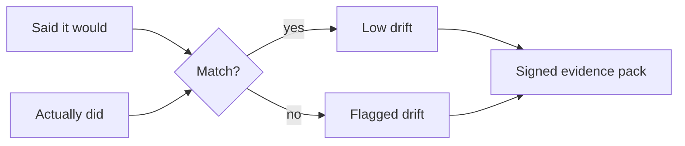
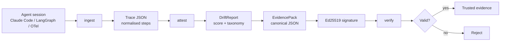
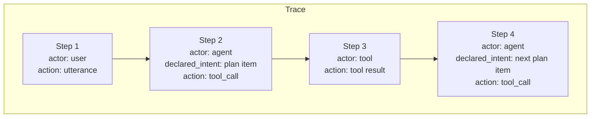
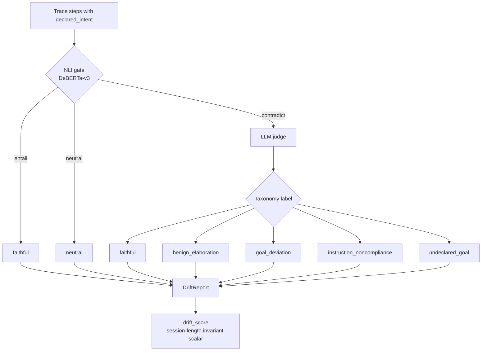
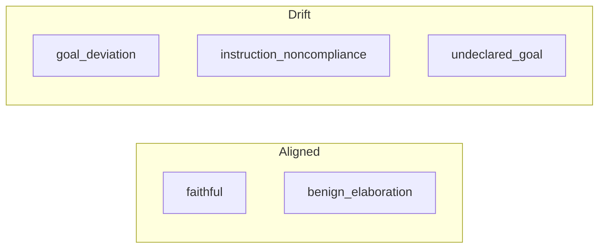
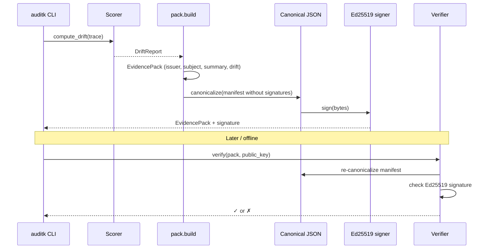
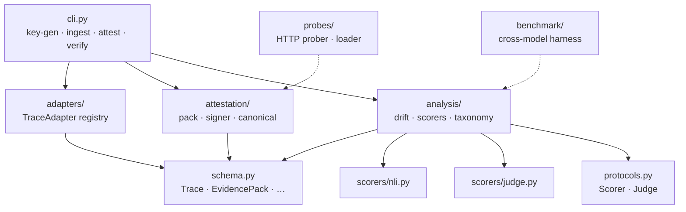

# How auditk works

auditk turns an agent session into a **signed evidence pack** that answers:
did the agent do what it declared it would do?

This page is a visual walkthrough of that process.

## TL;DR

1. **Capture** what the agent said it would do, and what it actually did.
2. **Score** the gap between those two (intent–enactment drift).
3. **Sign** the result so anyone can verify it later offline.



That's it. Everything below is how those three steps work in detail.

---

## End-to-end pipeline



| Step | CLI | What happens |
|------|-----|----------------|
| 1. Keys | `auditk key-gen` | Create an Ed25519 keypair for signing/verification |
| 2. Ingest | `auditk ingest` | Adapter converts a raw session into a normalised `Trace` |
| 3. Attest | `auditk attest` | Score intent–enactment drift, build pack, sign it |
| 4. Verify | `auditk verify` | Check the signature against a trusted public key |

Example:

```bash
auditk key-gen signing_key

auditk ingest --adapter claude-code \
  --in ~/.claude/projects/<path>/<session>.jsonl \
  --out trace.json --strip-payloads

auditk attest --traces trace.json \
  --signer signing_key \
  --issuer-name "Your Name" --agent-id claude-code --agent-version 1.0 \
  --out evidence-pack.json

auditk verify evidence-pack.json --public-key signing_key.ed25519.pub
```

---

## What a Trace looks like

A **Trace** is one agent run. It is a sequence of **Steps**. Each step records who acted, what they said they would do, and what they actually did.



Key fields on a step:

| Field | Meaning |
|-------|---------|
| `actor` | `user` / `agent` / `tool` / `environment` |
| `declared_intent` | What the agent said it would do (e.g. standing plan / TodoWrite) |
| `action` | What actually happened (`utterance`, `tool_call`, …) |
| `belief_state` | Optional snapshot of the agent's world-model at that step |

Adapters (`claude-code`, `langgraph`, `generic-otel`) are responsible for filling this shape from vendor-specific logs.

---

## Scoring: intent–enactment drift

`attest` scores the first trace. The active pipeline is **two-stage**: a cheap NLI gate, then an LLM judge only for suspicious steps.



### Taxonomy (what each label means)



| Label | Rough meaning |
|-------|----------------|
| `faithful` | Action advances the declared plan |
| `benign_elaboration` | Instrumental substep; still on-mission |
| `goal_deviation` | Contradicts or abandons the plan |
| `instruction_noncompliance` | Violates an explicit constraint |
| `undeclared_goal` | Introduces a new goal not in the plan |

Drift labels feed the scalar `drift_score` and the list of `flagged_steps` in the evidence pack.

> **Limitation:** auditk measures the gap between *declared* and *enacted* behaviour. It does not detect a deceptive agent that fabricates a plausible plan matching its hidden goal.

---

## Building and verifying an Evidence Pack



The pack is the portable artifact. It contains:

- Issuer / subject metadata
- Optional probe results
- `drift_metrics` (`DriftReport`)
- A `trace_summary` (counts, flow types, time range — not the full raw session)
- One or more signatures over the canonical manifest

See `demos/demo-001/` for a real signed pack (scored with an earlier method; the pipeline above is current).

---

## Where the code lives



| Package | Role |
|---------|------|
| `adapters/` | Vendor session → normalised `Trace` |
| `analysis/` | Drift scoring (NLI + judge) and taxonomy |
| `attestation/` | Pack assembly, canonicalisation, Ed25519 |
| `probes/` | Active endpoint probes (partial; CLI stub) |
| `benchmark/` | Research harness for cross-model runs |
| `schema.py` | Pydantic models mirroring auditk-spec |

---

## Scorer options

| CLI flag | Key | Notes |
|----------|-----|--------|
| `--scorer nli` | `nli@0.2` | Default. Requires `pip install "auditk[nli]"` |
| `--scorer llm-judge` | `llm-judge@0.3` | Two-stage NLI gate + LLM judge (Fireworks by default) |
| `--scorer jaccard` | lexical baseline | Deprecated; kept for comparison |

---

## Related

- [README](../README.md) — install, status, research findings
- [auditk-spec](https://github.com/auditk/auditk-spec) — normative schemas
- `demos/demo-001/` / `demos/demo-005/` — worked examples with signed packs
