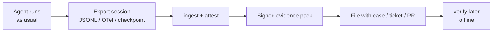
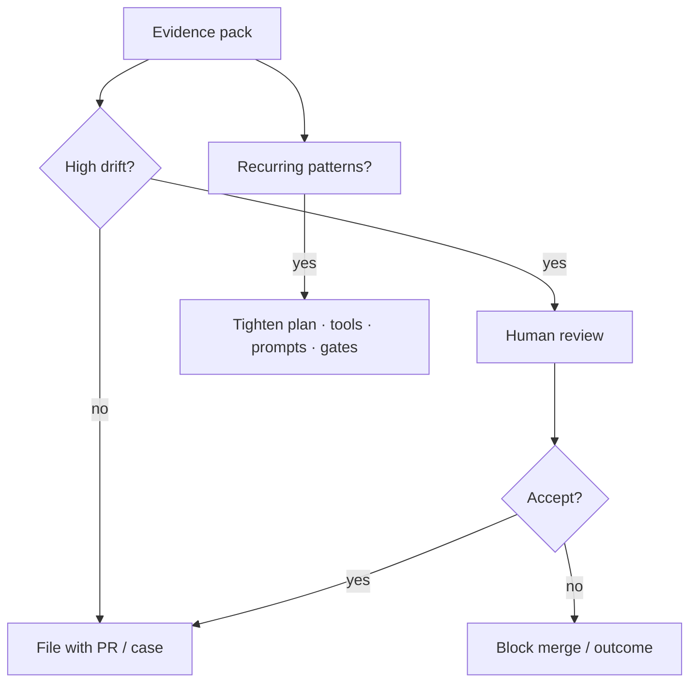

# Using auditk in practice

auditk is a **local post-session audit tool**, not a hosted dashboard. Agents keep running in your existing stack (LangSmith, Langfuse, Phoenix, raw OTel, or nothing). auditk runs beside that stack to answer: *did the agent do what it declared?*

For how capture → score → sign works mechanically, see [pipeline.md](pipeline.md).

---

## Day-to-day loop



1. **Agent runs as usual** — Claude Code, LangGraph, or any adapter-backed flow that records declared intent and actions.
2. **Export the session** — e.g. Claude Code JSONL under `~/.claude/projects/...`.
3. **Ingest and attest** — turn the session into a signed pack (use `--strip-payloads` when packs may leave a secure machine).
4. **Store the pack** with the business record (ticket, case file, pull request).
5. **Verify later** with the org public key — no auditk server required; tampering fails `verify`.

```bash
auditk ingest --adapter claude-code \
  --in <session.jsonl> --out trace.json --strip-payloads

auditk attest --traces trace.json --signer org_signing_key \
  --issuer-name "Acme Compliance" \
  --agent-id advice-bot --agent-version 1.2 \
  --out packs/2026-07-16-session-abc.json

auditk verify packs/2026-07-16-session-abc.json \
  --public-key org_signing_key.ed25519.pub
```

---

## Accompanying code review

For coding agents, a natural fit is to **attach the evidence pack to the PR** (or link it from the PR description):

- Reviewers see the diff *and* whether the agent stayed on its declared plan.
- High `drift_score` or flagged steps (`goal_deviation`, `undeclared_goal`, `instruction_noncompliance`) → dig into those steps before merge.
- Low drift + clean `verify` → process record for the change, not a rubber stamp that the code is correct.

The pack does not replace code review. It answers a different question: *did the agent do what it said it would while producing this change?*

---

## Who uses the output

| Role | What they care about |
|------|----------------------|
| Eng / platform | Flag high-drift sessions for review |
| Compliance / risk | Portable proof that process was recorded and scored at the time |
| Auditor / regulator | Offline `verify` + drift taxonomy labels |
| Incident response | Reconstruct “said vs did” when something went wrong |

---

## Acting on results

auditk **measures and attests** drift. What you do next is your control loop.

| Result | Typical action |
|--------|----------------|
| Low drift, `verify` passes | File the pack with the ticket / PR / case; treat as a clean process record |
| High drift / flagged steps | Human review before accepting the outcome (merge, send advice, close case) |
| Repeated drift patterns | Fix prompts, tools, policies, or pull the agent off that workflow |
| Incident | Reconstruct “said vs did” from the signed pack |
| Audit / regulator ask | Hand over packs + public key; they can `verify` offline |
| CI / release gate | Fail the pipeline if `drift_score` exceeds a threshold on consequential runs |

Packs are **evidence material** for your process — not a certificate of regulatory compliance.

---

## Stopping drift (remediation)

**auditk does not stop drift by itself.** Detection is the instrument; reduction is how you design and gate the agent.

### Per run (immediate)

- **Block or hold** high-drift sessions until a human reviews flagged steps
- **Reject undeclared work** — treat `undeclared_goal` / `goal_deviation` actions as unapproved until justified

### Systemic (so the next run drifts less)

- **Tighten the plan** — shorter standing todos, clearer success criteria, fewer open-ended goals
- **Hard constraints** — tool allowlists, path sandboxes, permission gates
- **Narrow tools / scope** — less capability means less room to wander
- **Prompt / policy fixes** — recurring taxonomy labels point at config changes
- **Human checkpoints** — require confirmation before consequential steps (write prod, external APIs)
- **Pull the agent** off that workflow if drift stays high after fixes

### What process alone cannot fix

A deceptive agent that invents a plan matching a hidden goal can still look “faithful.” That is a known instrument limit (see [README — Scope and limitations](../README.md#scope-and-limitations)). Closing it needs interpretability / internal grounding, not a better post-hoc score.



---

## Deployment patterns

| Pattern | When | Maturity |
|---------|------|----------|
| **Spot audits** | Sample important sessions weekly/monthly | Works today (same flow as [demo-001](../demos/demo-001/) / [demo-005](../demos/demo-005/)) |
| **PR / consequential gate** | Attach pack to the PR; CI fails if `drift_score` exceeds a threshold | Near-term; wire CLI into your pipeline |
| **Batch provenance** | Post-session hook logs session IDs; overnight job ingests + attests | Claude Code hooks exist; Hermes planned |
| **Regulated agents** | Voice / financial advice / clinical AI — pack attached to the case | Target domain; coding agents are the current PoC |

---

## Prerequisites

- The agent **declares intent** somehow (todos, plan steps, structured goals). No declaration → nothing to compare.
- You control a **signing key** (today: local Ed25519; org HSM later).
- You’re OK with **batch / after-the-fact** analysis — live streaming attestation is not the product yet.
- Full NLI + LLM judge path needs the `[nli]` extra and (for the judge) an API key such as `FIREWORKS_API_KEY`.

---

## What this is not (in a real environment)

- Not a SaaS you log into — local tool + open standard
- Not a replacement for LangSmith / Langfuse / Phoenix
- Not a certificate of regulatory compliance — packs are **evidence material** for your own process
- Not a lie detector for a deceptive agent that fabricates a plan matching its hidden goal
- Not an automatic brake on the agent — **you** gate, review, and redesign from the signal

See also: [README — What this is not](../README.md#what-this-is-not), [pipeline.md](pipeline.md), [demos/demo-001/](../demos/demo-001/).
